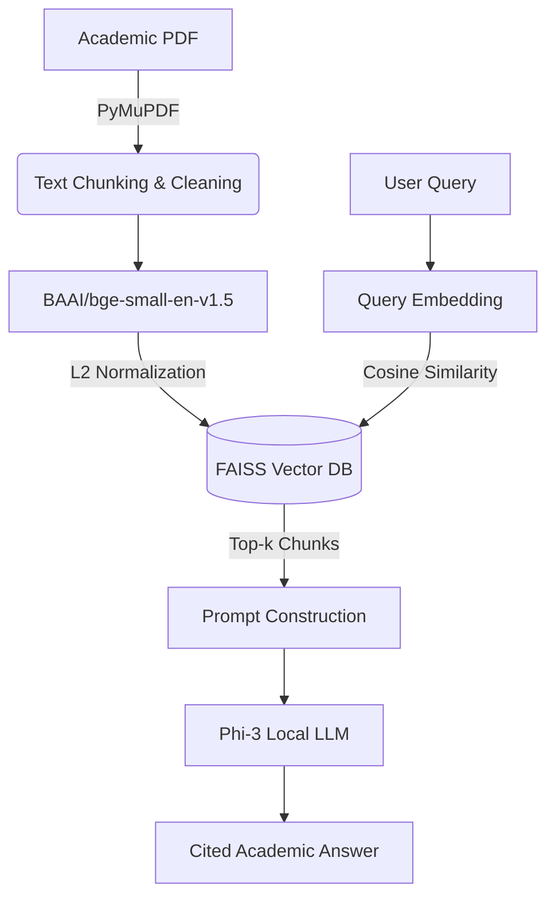

# Academic PDF RAG
RAG system for answering questions from academic PDFs using FAISS, BGE embeddings, and a quantized local Phi-3 LLM.

The system extracts text from PDFs, splits it into chunks, converts them into embeddings, retrieves the most relevant sections using FAISS, and generates answers using a locally running LLM.

## Features

- **Document Q&A:** Ask complex questions directly to your academic PDF documents.
- **Semantic Search:** Fast and accurate similarity search using vector embeddings and Meta FAISS.
- **Hardware Optimized:** Runs entirely locally on low-VRAM systems (Tested on RTX 3050 Ti 4GB) using a 4-bit quantized Phi-3 LLM.
- **Transparent Output:** Source retrieval includes exact similarity scores and page references for easy verification.
  
###  System Architecture


## Technologies Used

| Component | Technology | Primary Purpose in Pipeline |
| :--- | :--- | :--- |
| **Core Language** | `Python` | Main pipeline orchestration and logic construction. |
| **Vector Database** | `Meta FAISS` | High-speed semantic similarity search (`IndexFlatIP`). |
| **Embedding Model** | `BAAI/bge-small-en-v1.5` | Generating state-of-the-art dense vector representations optimized for RAG. |
| **Document Parsing**| `PyMuPDF (fitz)` | Fast, accurate text extraction and dynamic chunking from PDFs. |
| **LLM Engine** | `Phi-3 (Local)` | Offline text generation and context-based answering via REST API. |
| **Hardware Optimization**| `4-bit Quantization` | Compressing the model to run flawlessly on strict **Low VRAM (4GB)** constraints. |

## Installation

1. **Clone the repository**
```bash
git clone https://github.com/yourusername/academic-pdf-rag.git
cd academic-pdf-rag
```
2. **Install dependencies**
```bash
pip install -r requirements.txt
```
3. **Run the project**
```bash
python rag_pipeline.py
```

## Example Output

**User Query:** `Which AI techniques does Sora use?`

### Retrieval Phase (FAISS Vector Search)
*The system retrieved the most semantically relevant chunks using Cosine Similarity:*

| Rank | Cosine Score | Source Page |
| :---: | :---: | :---: |
| 1 | `0.8114` | Page 3 | 
| 2 | `0.8085` | Page 3 | 
| 3 | `0.7948` | Page 1 | 
| 4 | `0.7940` | Page 8 | 
| 5 | `0.7689` | Page 1 | 

### Generation Phase (Phi-3 Local Response)

**Phi-3:**  Based on the provided sources, it can be inferred that Sora utilizes several advanced AI techniques to achieve its text-to-video generation capabilities. The key techniques and approaches include:

1. Large Vision Models: As mentioned in Source 3 (Page: 1), Sora is a large vision model trained on diverse visual data, which allows it to process images and videos with varying durations, resolutions, and aspect ratios effectively. This approach enables the generation of high-quality video content from text prompts. 

2. Unified Visual Representation: Source 4 (Page: 8) discusses Sora's use of a unified visual representation to process diverse visual inputs. By transforming all forms of visual data into a consistent format, Sora can effectively scale its training and generate videos with high quality across different input types.   

3. Large-Scale Training Data: Source 4 (Page: 8) also highlights the importance of using large-scale training data for achieving high-quality results in generative AI models like Sora. This approach allows Sora to learn from a vast amount of visual information, enabling it to generate realistic and imaginative video content based on text prompts.

4. Leveraging Computation over Human-Designed Features: Source 3 (Page: 1) mentions that the training approach of Sora aligns with Richard Sutton's THE BITTER LESSON, which emphasizes leveraging computation and data rather than relying on human-designed features. This strategy enables more effective and flexible AI systems like Sora to generate high-quality video content from text prompts.

5. Background Technologies: Source 3 (Page: 1) also discusses the underlying technologies used in building Sora, such as diffusion transformers, which prioritize simplicity and scalability. These technologies contribute to the overall performance of Sora's generative capabilities.

In summary, Sora employs a combination of large vision models, unified visual representation techniques, extensive training data, computation-based approaches, and background technologies to generate high-quality text-to-video content from user prompts.


## Purpose of the Project

This project was built to explore and understand the **Retrieval-Augmented Generation (RAG) pipeline**, including:

- Document chunking
- Vector embeddings
- Semantic retrieval
- Local LLM inference

It demonstrates how LLM-based question-answering systems can be built for **academic document analysis**.
